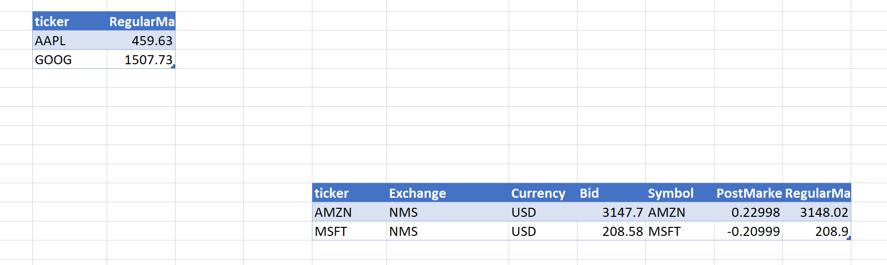

# Excel Stocks Addin

## Used open sources
- Excel.dna (https://excel-dna.net/)
- YahooFinanceApi (https://github.com/lppkarl/YahooFinanceApi) - MIT License

## Features
 - Create a table for tracking storkcs
 - Refresh stocks data to tables
 
## Todo
 - Providing an interface to call refreshing on VBA
 - Logging stocks data
